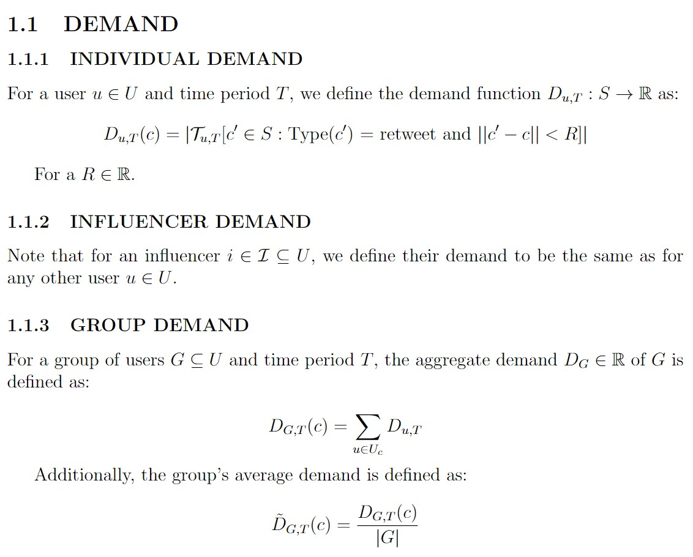
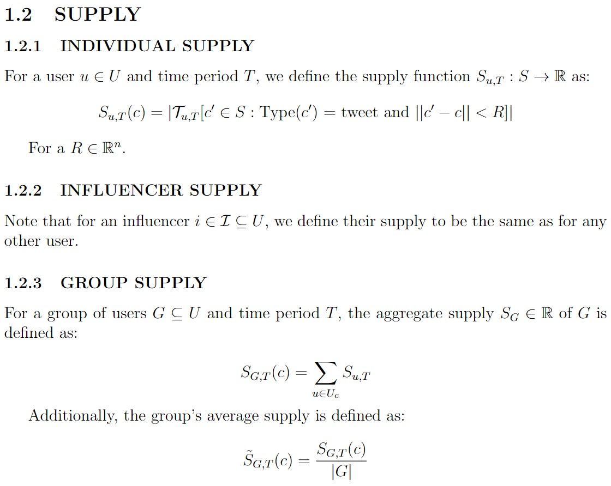
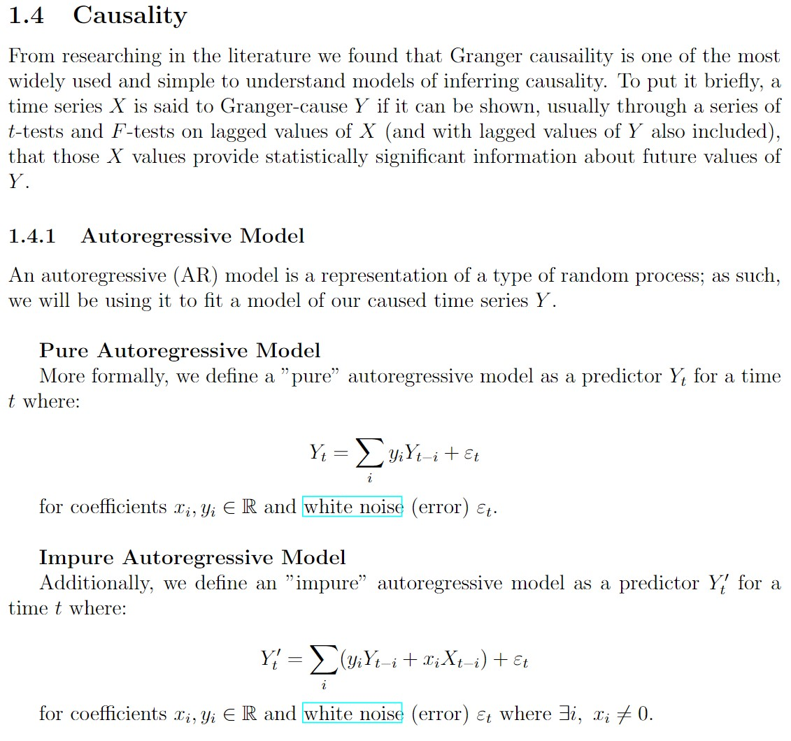
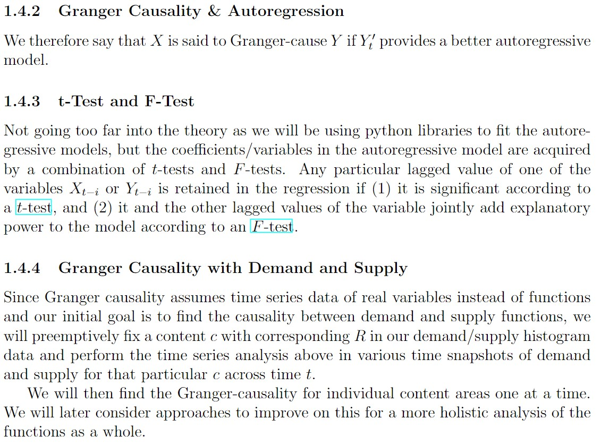

# Table of Contents

- [Introduction](#introduction)
- [High-Level Organization](#high-level-organization)
- [Implementation](#implementation)

# Introduction

In this project we aim to analyze content relationships in a network by calculating a value representing the amount of influence between any two agents.
For our purposes, an agent could be simply a single user or a set of users in a community.

More broadly, the goal of the project is to advance the understanding of social influence as a key feature of social media and a core mechanism underlying some of the main challenges emerging from the growing use of social media, including polarization, misinformation and disinformation, and the mental health crisis.
Specifically, we will test the hypothesis -- debated by sociological theorists but not empirically tested -- that social influence can be understood as a generalized (social) system of interchange, analogous to money or power.
Specifically, the project studies influence as a general system of interchange where attention and content are traded.

# High-Level Organization

In our code, we take a Object-Oriented Approach that is primarily reliant on the following classes:

## Tweet

A tweet object holds data about a tweet with respect to the following information:

- id
- timestamp: timestamp of tweet
- user: user who tweeted
- num_retweets: number of retweets
- likes: number of likes
- retweets: retweets of this tweet

It also holds a reference to the embedding representation of the tweet's content which is defined as a higher dimensional array in a latent space of content (see details in [Implementation](#implementation)).

These tweets are stored in the `processed_influence_tweets` database.
Moreover, the content embeddings are stored in a separate database to allow for effortless changes in the embedding algorithm as well as testing the efficacy of different embedding approaches.

## User

A User object holds data about a User with respect to the following information:

- id
- followers: users that follow this user
- following: users that this user is following
- tweets: the original tweets of this user
- retweets: the retweets of this user
- retweets in community: the retweets of this user's tweets or retweets by users that follow this user and with a post time after the corresponding tweet/retweet of this user (check who retweeted my retweet/tweet based on the timestamp and if the user follows me).

Refer to [Implementation](#implementation) for further details on how tweets, retweets and reweets in community are stored.

## Community

A community object holds information about a specific community.

- core nodes: the set of detected core nodes in a community
- users: array of all users pbjects in a community

It contains and is defined by a list of users.
Functionality includes processing all tweets from the community from the `raw_tweets` database to the `processed_influence_tweets`.

## Content Market

A content market is initialized with respect to a community and is used to manage and perform operations on the tweets within such community.
It holds information about:

- community: the community object for this content market

It provides functions that calculate:

- **Demand** for a given content embedding, set of users and time range.

- **Supply** for a given content embedding, set of users and time range.

- **Causation** between any two values of demand or supply given a content embedding.

The functions above are more rigorously defined as following:

Refer to [this document](https://www.overleaf.com/6251411237wbdjqsjvrrjj) for more context on the definitions above, if needed.

Values are computed on demand, output to the user, and stored in a `content_market` database. This has two purposes: 1) it allows values to be cached to reduce the time of future queries, and 2) It allows the `content_market` database to act as an output of our project, so that future research can populate certain content markets and then operate additional experiments using these content markets as input.

## DAO

For each of the above objects, we have a corresponding DAO object. This DAO objects acts as an interface with MongoDB, allowing us to seperate the database accesses with our high level object definitions, giving us resiliciency to data definition changes and seperating database accesses from the responsbility of our objects. These DAO objects have load and write functions.

# Implementation

## High-Level OOP Diagram TODO

## Latent Space Embedding

We rely on previous literate for latent space embedding of our model, namely [tweet2vec](https://arxiv.org/abs/1605.03481).
For starters, this approach assumes that posts with the same hashtags should have embeddings which are close to each other.
Hence, the authors train a Bi-directional Gated Recurrent Unit (Bi-GRU) neural network with the training objective of predicting hashtags for a post from its latent representation in order to verify latent representation correctness.

The dataset used for training the model consists of over 2 million global tweets in English between the dates of June 1, 2013 to June 5, 2013 with at least one hashtag.
This could impose a bias in the data where the model performs differently on posts without hashtags.
As such, we allow our program to easily integrated other embedding techniques for comparison.

We thus consider trying two further approaches:

1. Averaging the word embedding vectors of every word in a tweet
2. Training a new tweet2vec encodder based strictly on our community's tweets

### Demand / Supply Functions

The supply and demand functions are represented as a hashtable that maps a tuple of size n to its respective quantity of demand/supply, where n is the dimension of the latent space. 
An n-tuple corresponds to a 'bin' or space in $R^n$, which are equal in size and aligned on non-overlapping intervals (for example, bin 1 may be a hypercube of size 1 centered at the zero vector, bin 2 a hypercube of size 1 centered at the $\vec{1}$, and so on until all tweets are encompassed within a hypercube).
We have a utility function which maps a given content vector to key / n-tuple that corresponds to the bin containing the vector. The support of the function is the keys in the hashtable, as only bins with non-zero demand or supply are keys.

### Storing Tweets

In order to retrieve demand and supply information more efficiently, we store tweets in the User class (for the fields <tweets>, <retweets> and <retweets in community>) in an n-tuple dictonary explained above for each of the three fields. 
This allows any algorithm traversing tweet data to only consider the tweets that are within the boundaries of the content interval we defined for any given content while also allowing for iterating over the entire dictionary if needed.

## Causality

### Overview
To infer causality (influence) between nodes, we capture supply and demand data over time, and use granger causality to infer if there is any relationship between the time series. We use [this module](https://www.statsmodels.org/dev/generated/statsmodels.tsa.stattools.grangercausalitytests.html) to implement the granger causality function.

### Implementation
Recall that in our implementation of supply and demand functions, we have partitionined the $R^n$ space of content embeddings into non-overlapping hypercubes. Each non-empty hypercube represents a key in our hash table, its value representing the supply/demand information. 

Over time, we can construct time series of supply and demand in each bin, and calculate the granger causality for each bin for a given time period. Since we know that calculating granger causality will output a value between 0 and 1, we can augment this information in the hash table, corresponding to each key(bin).

Now, we want to generalize the granger causality across all bins, which can be done through multiple approaches. Some proposed approaches are: by calculating the mean, euclidean norm, or p-norm for any given p $\in Z^+$. For all of these approaches, the preliminary stages are the same - iterate through the keys(bins) in our hash table and get the granger causality (value between 0 and 1) of all of them. Notice that since we only have bins with non-zero supply/demand values, we have finitely many of them, making it possible to iterate through all of them. Now that we have the granger causality data for all bins, we can find a way to see patterns in the data and infer causality across all non-zero bins in the $R^n$ space. 

We will explore some of our approaches here: We can calculate the mean of the granger causality in all bins, giving us an average across all non-zero bins in the $R^n$ space. An alternate approach would be to calculate the p-norm, and normalizing the output so that it lies between 0 and 1. The norm is able to capture different patterns in the data - for example, a 2-norm (or the euclidean norm) will skew values closer to 0 further towards 0, and values closer to 1 will be skewed less. As p gets higher, the higher the skewing gets. 
